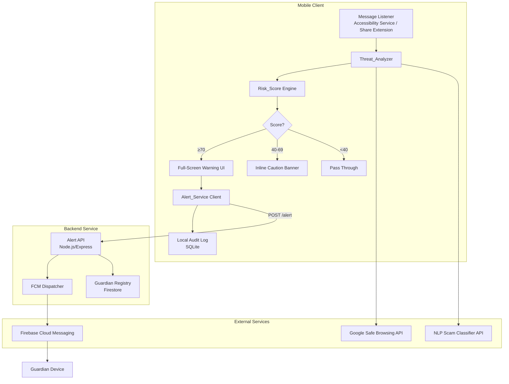

# Design Document: ScamGuardian

## Overview

ScamGuardian is a mobile application (targeting Android and iOS via React Native) that provides real-time scam detection and family alerting for elderly and non-tech-savvy users. The system intercepts incoming messages from monitored channels, analyzes them for scam indicators, assigns a Risk_Score, and — when the score is high enough — immediately notifies a designated Guardian before the user can interact with any harmful content.

### Key Design Goals

- Sub-5-second scan latency from message receipt to Risk_Score assignment
- Sub-10-second Guardian push notification delivery for high-risk messages
- Accessibility-first UI: large text, plain language (≤ Grade 6 reading level), high-contrast warnings
- Offline-capable local audit log with automatic storage management
- Minimal configuration burden on the protected User; Guardian drives setup

### Technology Choices

| Concern | Choice | Rationale |
|---|---|---|
| Mobile framework | React Native | Single codebase for Android + iOS; large ecosystem |
| Push notifications | Firebase Cloud Messaging (FCM) | Cross-platform, reliable, free tier sufficient; [FCM docs](https://firebase.google.com/docs/cloud-messaging) |
| Backend API | Node.js + Express | Lightweight, fast I/O for notification dispatch |
| Threat analysis | Hybrid: local regex/heuristics + remote NLP API | Local rules for speed; remote ML for accuracy |
| URL blocklist | Google Safe Browsing API + cached local copy | Continuously updated; [Safe Browsing](https://developers.google.com/safe-browsing) |
| Local storage | SQLite via react-native-sqlite-storage | Reliable, queryable, works offline |
| Auth | Firebase Auth (phone number) | Simple for elderly users; no password required |

---

## Architecture

The system is split into three layers: the mobile client, a lightweight backend service, and external threat intelligence feeds.



### Data Flow for a High-Risk Message

1. Message arrives in monitored channel → Accessibility Service captures text
2. Threat_Analyzer extracts URLs, text body, sender, attachment metadata
3. URLs checked against local blocklist cache; cache miss triggers Safe Browsing API call
4. Text body analyzed by local regex rules (urgency language, impersonation patterns)
5. If local rules are inconclusive, text sent to remote NLP classifier
6. Risk_Score computed as weighted combination of all signals
7. If Risk_Score ≥ 70: full-screen warning shown + POST /alert sent to backend
8. Backend dispatches FCM push to Guardian device(s)
9. Audit log entry written to local SQLite

---

## Components and Interfaces

### 1. Message Listener

Captures incoming messages from monitored channels.

- **Android**: Accessibility Service reads notification content from WhatsApp, SMS, email apps
- **iOS**: Share Extension allows manual forwarding; notification content extension for supported apps
- **Interface**: emits `MessageEvent { id, channel, sender, body, attachments[], timestamp }`

### 2. Threat_Analyzer

Orchestrates all detection sub-modules and produces a Risk_Score.

```typescript
interface ThreatAnalysis {
  messageId: string;
  riskScore: number;          // 0–100
  indicators: ThreatIndicator[];
  analyzedAt: Date;
}

interface ThreatIndicator {
  type: 'phishing_url' | 'urgency_language' | 'impersonation' | 'investment_scam' | 'malicious_attachment';
  confidence: number;         // 0–1
  evidence: string;           // human-readable snippet
}

interface ThreatAnalyzerService {
  analyze(message: MessageEvent): Promise<ThreatAnalysis>;
}
```

Sub-modules:
- **URLChecker**: queries local blocklist cache, falls back to Safe Browsing API
- **TextClassifier**: regex rules for urgency/impersonation/investment patterns + remote NLP fallback
- **AttachmentScanner**: checks file extension against known malicious types

### 3. Risk_Score Engine

Combines signals from sub-modules into a single 0–100 score using a weighted formula:

```
riskScore = clamp(
  urlScore * 0.45 +
  textScore * 0.35 +
  attachmentScore * 0.20,
  0, 100
)
```

Each sub-score is 0–100. Weights reflect that phishing URLs are the most reliable indicator.

### 4. Warning UI

- **FullScreenWarning**: shown when riskScore ≥ 70; renders primary heading, two action buttons, large text (≥ 20sp)
- **CautionBanner**: inline overlay shown when riskScore 40–69
- Both components accept a `ThreatAnalysis` prop and render plain-language descriptions

### 5. Alert_Service Client

Sends alert payloads to the backend and handles Guardian response callbacks.

```typescript
interface AlertPayload {
  userId: string;
  messageId: string;
  sender: string;
  threatSummary: string;      // plain-language, ≤ Grade 6
  riskScore: number;
  timestamp: string;          // ISO 8601
  userRequestedHelp: boolean;
}

interface GuardianAction {
  messageId: string;
  action: 'mark_safe' | 'confirm_scam' | 'call_user';
  guardianId: string;
  timestamp: string;
}
```

### 6. Backend Alert API

Stateless Node.js service with two endpoints:

| Method | Path | Description |
|---|---|---|
| POST | /alert | Receive alert from mobile client, dispatch FCM to Guardian |
| POST | /guardian/action | Receive Guardian's response, push update back to User device |

Guardian device tokens and User↔Guardian mappings are stored in Firestore.

### 7. Local Audit Log

SQLite table `audit_log`:

| Column | Type | Notes |
|---|---|---|
| id | TEXT PK | UUID |
| timestamp | INTEGER | Unix epoch ms |
| sender | TEXT | |
| risk_score | INTEGER | |
| threat_types | TEXT | JSON array |
| outcome | TEXT | 'user_safe' \| 'user_help' \| 'guardian_safe' \| 'guardian_scam' |
| message_preview | TEXT | First 200 chars, no PII beyond sender |

Entries are written for all messages with riskScore ≥ 40. Storage management runs on app foreground: if total size > 500 MB, oldest entries are deleted until size < 400 MB.

### 8. Onboarding_Flow

A 5-step wizard (Guardian-driven):

1. **Welcome** — explains what ScamGuardian does
2. **Guardian Contact** — Guardian enters their phone/email
3. **Permissions** — plain-language prompts for Accessibility Service + Notification Access
4. **Test Alert** — sends a test FCM notification to Guardian
5. **Done** — confirmation screen

---

## Data Models

### MessageEvent

```typescript
interface MessageEvent {
  id: string;               // UUID generated on capture
  channel: 'whatsapp' | 'sms' | 'email' | 'other';
  sender: string;           // display name or phone number
  body: string;             // full text content
  attachments: Attachment[];
  timestamp: Date;
}

interface Attachment {
  filename: string;
  mimeType: string;
  extension: string;
  sizeBytes: number;
}
```

### UserProfile

```typescript
interface UserProfile {
  userId: string;
  guardianId: string;
  guardianContact: string;  // phone or email
  safeModeEnabled: boolean;
  largeFontEnabled: boolean;
  fcmToken: string;
  onboardingComplete: boolean;
}
```

### AuditLogEntry

```typescript
interface AuditLogEntry {
  id: string;
  timestamp: Date;
  sender: string;
  riskScore: number;
  threatTypes: ThreatIndicator['type'][];
  outcome: 'user_safe' | 'user_help' | 'guardian_safe' | 'guardian_scam' | 'pending';
  messagePreview: string;
}
```

### GuardianNotification

```typescript
interface GuardianNotification {
  notificationId: string;
  userId: string;
  messageId: string;
  sender: string;
  threatSummary: string;
  riskScore: number;
  timestamp: Date;
  responded: boolean;
  respondedAt?: Date;
  reminderSentAt?: Date;
}
```

---
